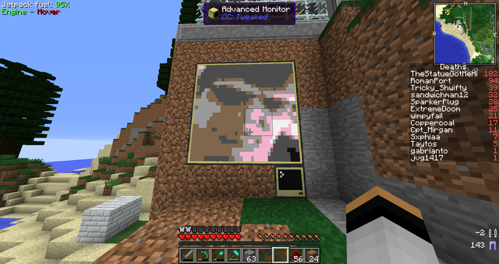
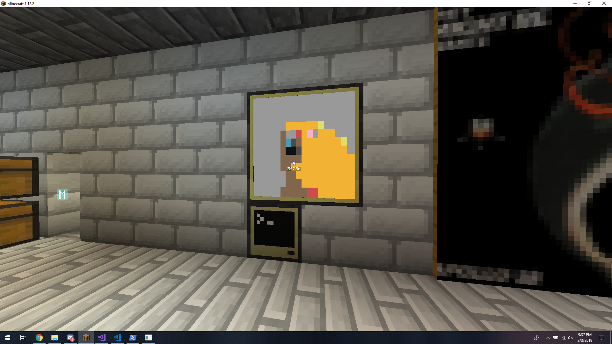

#ComputerCraft Web Images
A simple program to download images from the web and show them in the popular Minecraft mod, ComputerCraft. Written in about an hour.

Is it stupid? Absolutely.

##Setup
First, forward a port in your router and set the port in Program.cs to run a web server. ComputerCraft requires full hostnames and will not work on IP addresses, at least local ones. Start the C# program. Next, run ``pastebin get zBr8XhJ3 image`` in a ComputerCraft computer with monitors placed on top of it. Now, run ``edit image`` and edit the URL used to point to yourself. Now, press the control key and select ``Save``, then press the control key and press ``Exit``. Now, from the ComputerCraft terminal, type ``image`` and hit enter. You'll see an image be loaded on the monitors if it worked. Now, you can paste URLs into the C# console program to change the image that is displayed.